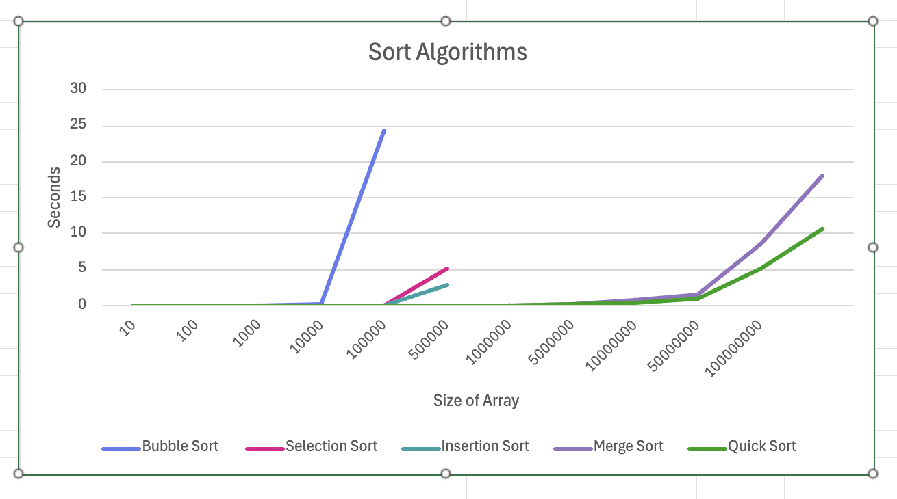

Name: Aliya Salmanova


# Sort Analysis Data

## Results Table
Make sure to go out to at least 100,000 (more are welcome), and you have 10 different values (more welcome). You are welcome to go farther, but given 100,000 can take about 20 seconds using a selection sort on a fast desktop computer, and 200,000 took 77 seconds, you start having to wait much longer the more 0s you add. However, to build a clearer line, you will want more data points, and you will find merge and quick are able to handle higher numbers easier (but at a cost you will explore below). 

You are free to write a script to run the program and build your table (then copy that table built into the markdown). If you do that, please include the script into the repo.  Note: merge and quick sorts are going to be explored in the team activity for Module 06. You can start on it now, but welcome to wait.

 

### Table [^note]
| N   | Bubble | Selection | Insertion | Merge | Quick |
| :-- | :--: | :--: | :--: | :--: | :--: |
|10| 0.000002 | 0.000002 | 0.000001 | 0.000002 | 0.000002 |
| 100 | 0.000046 | 0.000023 | 0.000010 | 0.000011 | 0.000005 |
| 1000 | 0.003821 | 0.001366 | 0.000724 | 0.000150 | 0.000104 |
| 10000 | 0.202533 | 0.077554 | 0.045080 | 0.001899 | 0.001391 |
| 100000 | 24.397708 | 5.048570 | 2.857542 | 0.021396 | 0.008601 |
| 1000000 | - | - | - | 0.154911 | 0.100717 |
| 5000000 | - | - | - | 0.758238 | 0.456034 |
| 10000000 | - | - | - | 1.587748 | 0.975767 |
| 50000000 | - | - | - | 8.655033 | 5.185552 |
| 100000000 | - | - | - | 18.066167 | 10.677068 |


## BigO Analysis  / Questions

### 1. Build a line chart
Build a line chart using your favorite program. Your X axis will be N increasing, and your Y access will be the numbers for each type of sort. This will create something similar to the graph in the instructions, though it won't be as smooth. Due to speed differences, you may need to break up the $O(\log n)$ and $O(n^2)$ into different charts.

Include the image in your markdown. As a reminder, you save the image in your repo, and use [image markdown].

```markdown

```

### 2. Analysis
Looking at the graph and the table, what can you say about the various sorts? Which are the fastest? Which are the slowest? Which are the most consistent? Which are the least consistent? Use this space to reflect in your own words your observations.
It looks like merge sort and quick sort are the fastest, while bubble sort is the slowest. Insertion sort is better than selection sort.

### 3. Big O
Build another table that presents the best, worst, and average case for Bubble, Selection, Insertion, Merge, and Quick. You are free to use resources for this, but please reference them if you do. 


#### 3.2 Worst Case
Provide example of arrays that generate _worst_ case for Bubble, Selection, Insertion, Merge Sorts
The worst case for Bubble sort would be a reverse sorted array [9, 8, 7, 6, 5, 4, 3, 2, 1, 0]. This is because there would be no early exit.
During every inner loop there would be swaps. 

In selection sort there isn't as big of a difference between worse case and best case, because even with a sorted array, you have to complete the inner loop
during every iteration of the outer loop. However, with a reverse sorted array, there would be more swapping the min with the next found min, which wouldn't happen
with an already sorted array, as the min value of the numbers after i wouldn't change. Therefore, the worse case is still a reverse sorted array,
but it's not as solid of a worse case. 

In insertion sort, the worst case is a reverse sorted array [9, 8, 7, 6, 5, 4, 3, 2, 1, 0]. 
With the worst case, the inner loop would have to complete itself every iteration of the outer loop, and the maximum amount of shifting would have to happen. 

With merge sort, there is no worse case. We split each half of the array further into halves, until we become unable to split further.
Then we merge the sorted halves with each other. No matter what the halves are consisted of, the merge has to take place just the same.


#### 3.3 Best Case
Provide example of arrays that generate _best_ case for Bubble, Selection, Insertion, Merge Sorts 
The best case for bubble sort would be an already sorted array [0, 1, 2, 3, 4, 5, 6, 7, 8, 9] as there would be no swaps 
and you would exit out very early. 

The best case for selection sort would also be an already sorted array, though we would still have to traverse through the outer loop and inner loop 
until the end, as there is no early exit for this algorithm. There isn't a way to know if the rest of the numbers are sorted with this algorithm. 

The best case for insertion sort would be an already sorted array [0, 1, 2, 3, 4, 5, 6, 7, 8, 9] as we would not need to ever perform the inner loop,
as j would always be less than i, hence resulting in O(n) time complexity and no shifting. 

There isn't a best case for merge sort. No matter what the values are, the algorithm requires to split the halves of the array until you are left with arrays of 
one element, and then you have to merge by comparing the values of the halves. Hence going down a tree and then upwards again.


#### 3.4 Memory Considerations
Order the various sorts based on which take up the most memory when sorting to the least memory. You may have to research this, and include the mathematical notation. 
1. Merge Sort - O(n), with additional space for the temporary arrays used when merging
2. Quick Sort - O(n) in worse case and O(log n) in best case 
3. Bubble Sort - O(1) as you only need space for the temporary variables
4. Insertion Sort - O(1) as you only need space for the temporary variables
5. Selection Sort - O(1) as you only need space for the temporary variables

(The last three have the same memory/auxiliary space complexity.)

### 4. Growth of Functions
Give the following values, place them correctly into *six* categories. Use the bullets, and feel free to cut and paste the full LatexMath we used to generate them.  

$n^2$  
$n!$  
$n\log_2n$  
$5n^2+5n$  
$10000$  
$3n$    
$100$  
$2^n$  
$100n$  
$2^{(n-1)}$
#### Categories
* $100$ $10000$
* $100n$ $3n$
* $n\log_2n$ 
* $n^2$ $5n^2+5n$
* $2^n$ $2^{(n-1)}$
* $n!$

### 5. Growth of Function Language

Pair the following terms with the correct function in the table. 
* Constant, Logarithmic, Linear, Quadratic, Cubic, Exponential, Factorial

| Big $O$     | Name        |
| ------      |-------------|
| $O(n^3)$    | Cubic       |
| $O(1)$      | Constant    |
| $O(n)$      | Linear      |
| $O(\log_2n)$ | Logarithmic |
| $O(n^2)$    | Quadratic   |
| $O(n!)$     | Factorial   |
| $O(2^n)$    | Exponential |


### 6. Stable vs Unstable
Look up stability as it refers to sorting. In your own words, describe one sort that is stable and one sort that isn't stable  
Insertion sort is stable because it only shifts values that are greater than i by one shift to the right. Equal values
wouldn't get swapped with each other, they could just both shift right, so therefore the order gets preserved.

Selection sort does not adhere to order preservation as values that come earlier in the array than their equals can get swapped with smaller values that come
later than both of these equal values.


### 6.2 When stability is needed?
Explain in your own words a case in which you will want a stable algorithm over an unstable. Include an example. 
Stable algorithms allow equal elements in the data set to have their order preserved. This is useful when the data is already sorted
by one criteria, and you need to sort them by another criteria also, but have the elements that are equal according to the initial criteria 
remain in the same order. One of the resources I looked up refers to it as 'chain sorting the arrays by multiple fields'. 
An example is, say, we are at a refuge camp and children under age 10 can enter their names and ages for volunteers in a charity community to give them prepared meals.
The youngest children should be fed first, so the data should be sorted by age, but children that are the same age should remain sorted
by the time when they entered their information. So the same-aged children need to preserve the order in which the data was initially sorted,
which was by the time/date they entered their information. 

### 7. Gold Thief

You are planning a heist to steal a rare coin that weighs 1.0001 ounces. The problem is that the rare coin was mixed with a bunch of counter fit coins. You know the counter fit coins only weight 1.0000 ounce each. There are in total 250 coins. You have a simple balance scale where the coins can be weighed against each other. Hint: don't think about all the coins at once, but how you can break it up into even(ish) piles. 

#### 7.1 Algorithm
Describe an algorithm that will help you find the coin. We encourage you to use pseudo-code, but not required.
I would use merge sort, with a small change. So, I'd split the coin stash in half. The difference is that I'd organize them so that 
I could make sure the stash is even (in reality I'd have to organize them to see, but with an algo I can just check if the stash is even).
If it is odd, I'd set one aside and weigh that one separately to make sure it is not our rare coin. 
Then I'd weigh the halves. If one, stash is bigger, then we know that our rare coin is that stash, hence narrowing down our options. 
So then I'd look at that stash, and keep doing the same thing recursively, until I find the special coin.
//split stash in two
//check if stash is even. If not, set one aside and weigh to see if it's the right coin. 
//weigh both halves 

#### 7.2 Time Complexity
What is the average time complexity of your algorithm? 
The time complexity is O(log n). It is similar to merge sort as it is a divide and conquer technique but you don't have to loop to 
do any kind of merging here. 


## Technical Interview Practice Questions

For both these questions, are you are free to use what you did as the last section on the team activities/answered as a group, or you can use a different question.

1. Select one technical interview question (this module or previous) from the [technical interview list](https://github.com/CS5008-khoury/Resources/blob/main/TechInterviewQuestions.md) below and answer it in a few sentences. You can use any resource you like to answer the question.
   Quadratic sorts are extremely slow and not scalable. So why do we learn about them and when would we ever use one?
My own thoughts before research:
Reason 1. Learning different quadratic sorts helps us learn Big O Notation and understand it, 
which will in turn help us write our own solutions to problems efficiently, accounting for memory and runtime. 
Reason 2. It helps us train our critical thinking skills in the context of computer science.
Reason 3. There probably was a time where merge sort was not thought of yet, so we might still see quadratic sorts used in very old applications.
Reason 4. There could be certain problems where the more efficient sorts simply could not be possible to use. 
In some problems, the best case is still quadratic. 
Reason 5. Perhaps in a case where memory is very important to save and runtime does not matter, we could use a quadratic sort. 
Reason 6. Coming up with more efficient algorithms I presume has been going on for a long time for computer scientists,
and thinking of more efficient ways to solve problems is relevant to what we will be doing in the future, therefore these are the basics. 

Answer from source:
For a very small nearly-sorted array, a quadratic sort would actually be more efficient. 
Some quadratic sorts are combined with other techniques such as in Timsort. 
Some of my reasons were written in the source in different words, such as reasons 1, 2, and 6. 

   
2. Select one coding question (this module or previous) from the [coding practice repository](https://github.com/CS5008-khoury/Resources/blob/main/LeetCodePractice.md) and include a c file with that code with your submission. Make sure to add comments on what you learned, and if you compared your solution with others. 
 I solved 905. Sort Array By Parity in the Lab on Sunday, Sep 21st. The group members gave me moral support and 
would help me with bugs, such as the last part where you have to assign numsSize to *returnSize. Group 1 members are Karina Quenta, 
Siddharth Kakked, Emily Despres, and me. 

## Deeper Thinking
Sorting algorithms are still being studied today. They often include a statistical analysis of data before sorting. This next question will require some research, as it isn't included in class content. When you call `sort()` or `sorted()` in Python 3.6+, what sort is it using? 

Apparently Python has used Timsort, but since version 3.11, it uses Powersort instead. 


#### Visualize
Find a graphic / visualization (can be a youtube video) that demonstrates the sort in action.
YouTube. shnake_case (11 months ago). What is Timsort and why it's so popular? YouTube. https://www.youtube.com/watch?v=4lKVoX6f0m8

#### Big O
Give the worst and best case time-complexity, and examples that would generate them. 

The best case time complexity for timsort would be O(n). The example that generates it would be an already sorted array [0, 1, 2, 3, 4, 5, 6, 7, 8, 9],
as in tim sort we check which parts of the array are already sorted. In this case, no merging would need to be done. 

The worst case is if there are no sorted chunks of data within the array, such as [10, 1, 5, 2, 8, 3, 9, 4]. 
The time complexity for this would be O(n log n), because the algorithm would have to be treated the same as merge sort. 

<hr>

## References
Add your references here. A good reference includes an inline citation, such as [1] , and then down in your references section, you include the full details of the reference. Use [ACM Reference format].

1. Reference info, date, etc.
2. R/learnprogramming on reddit: Why is it important to learn less efficient sorting algorithms? (n.d.). https://www.reddit.com/r/learnprogramming/comments/29hyo9/why_is_it_important_to_learn_less_efficient/
3. Wikimedia Foundation. (2025, August 1). Timsort. Wikipedia. https://en.wikipedia.org/wiki/Timsort#:~:text=Timsort%20has%20been%20Python’s%20standard,%2C%20in%20Swift%2C%20and%20Rust.
4. YouTube. shnake_case (11 months ago). What is Timsort and why it's so popular? YouTube. https://www.youtube.com/watch?v=4lKVoX6f0m8
5. GeeksforGeeks. (2025, July 26). Time complexities of all sorting algorithms. https://www.geeksforgeeks.org/dsa/time-complexities-of-all-sorting-algorithms/?utm_source=chatgpt.com


## Footnotes:
[^note]: You will want at least 10 different N values, probably more to see the curve for Merge and Quick. If bubble, selection, and insertion start to take more than a minute, you can say $> 60s$ or - . For example 
    | N | Bubble | Selection | Insertion | Merge | Quick |
    | :-- | :--: | :--: | :--: | :--: | :--: |
    | 10,000|0.197758|0.070548|0.000070|0.000513|0.000230|
    |100,000|-|-|-|0.131061|0.018602|

<!-- links moved to bottom for easier reading in plain text (btw, this a comment that doesn't show in the webpage generated-->
[image markdown]: https://docs.github.com/en/get-started/writing-on-github/getting-started-with-writing-and-formatting-on-github/basic-writing-and-formatting-syntax#images

[ACM Reference Format]: https://www.acm.org/publications/authors/reference-formatting
[IEEE]: https://www.ieee.org/content/dam/ieee-org/ieee/web/org/conferences/style_references_manual.pdf